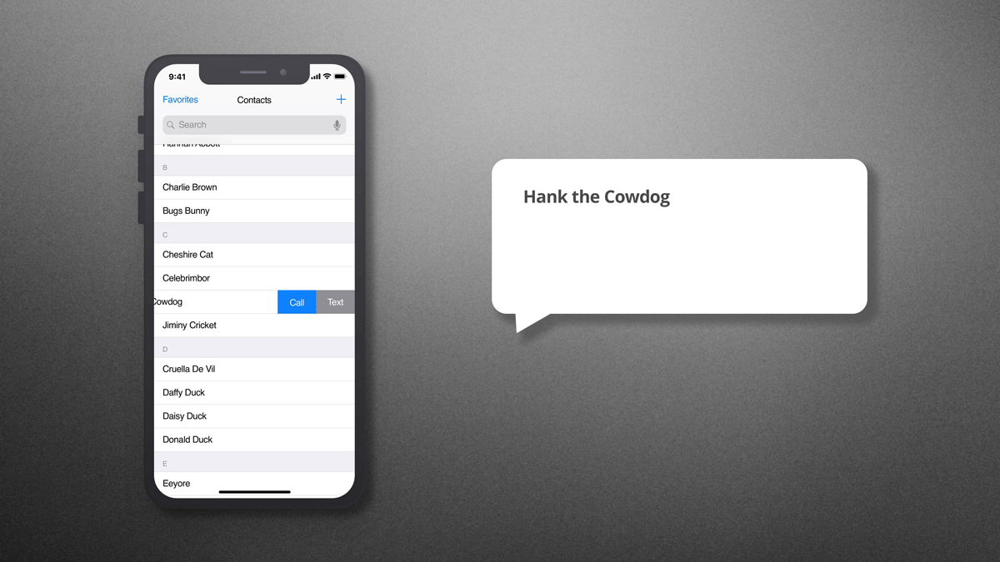
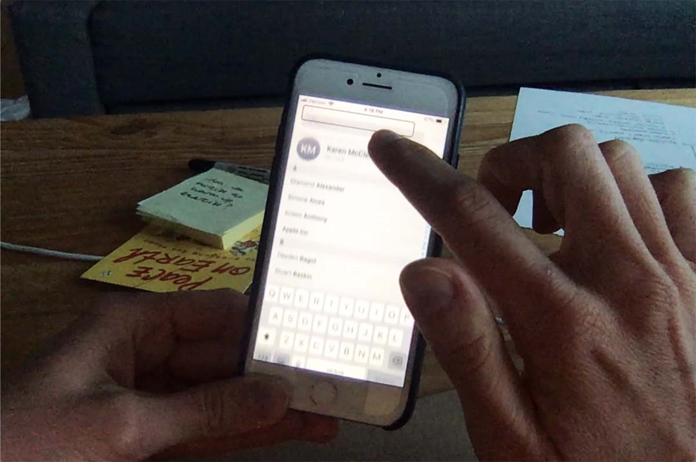
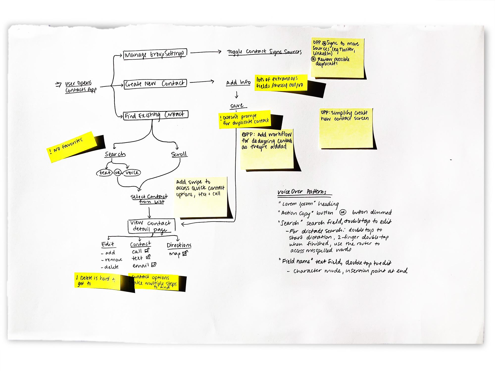
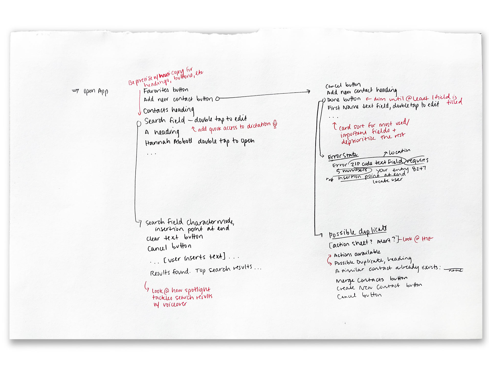
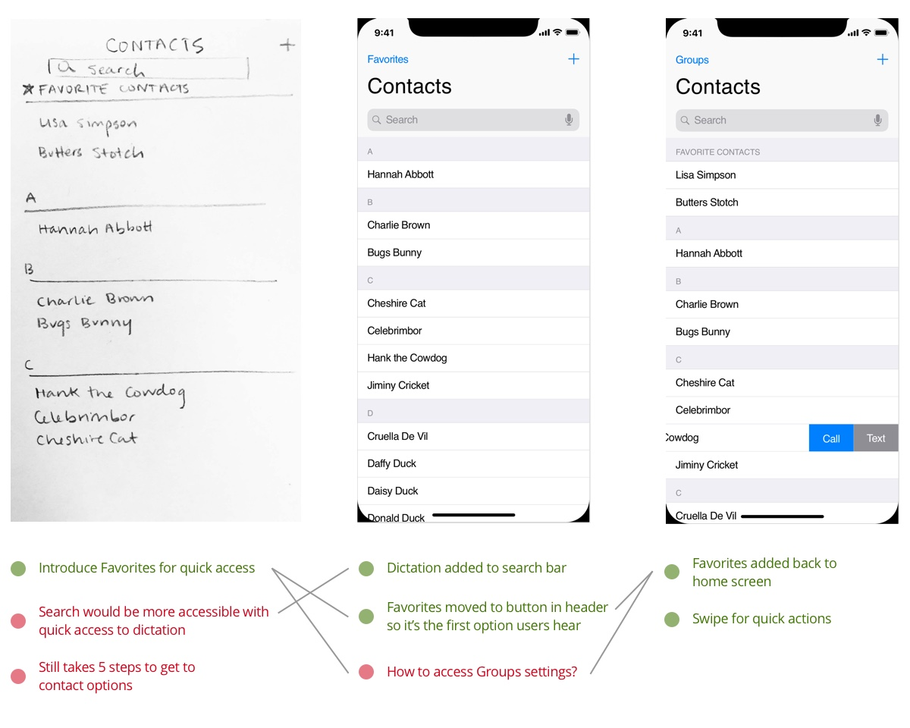

# iOS Contacts
## Optimized for Accessibility

###Challenge
#####How could Apple refine its iOS Contacts app to optimize accessibility under WCAG and A11Y guidelines?

The iPhone is already the preferred mobile platform for visually impaired users, due to Apple’s attention to accessibility best practices and its robust screen reader, VoiceOver. Explore the iOS Contacts app and identify opportunities to further optimize the experience for users who rely on VoiceOver to navigate their phones.

**My Role** | UX, UI
 **Tools Used** | Pencil + Paper, Sketch, After Effects
 **The Process** | [Research](#research), [Insights & Opportunities](#insights), [The Problem](#problem), [Design Solutions](#solution)

***

###Research
#####Screen readers require users to sift through a huge volume of content.
I began the research process with **contextual inquiry**, both in person and via video, observing visually impaired users as they navigated their phones with VoiceOver. The users almost always completed tasks and navigated through user flows as quickly or more so than non-impaired users. They dialed up the speed of the screen reader and were able to process content and take actions extremely quickly. Due to the huge amount of spoken content, users appreciated experiences that were streamlined and direct.

To further explore screen reader UX, I went into my own iPhone’s settings and activated VoiceOver for a **context of use analysis**. For 2 days, I navigated my phone with VoiceOver, with special focus on the Contacts app, noting how gesture-based interactions changed and learning how affordances were communicated.

#####Minimum accessibility requirements aren’t good enough.
Next, I dug into the A11Y guidelines, WCAG 2.0, and some secondary UX research to understand current accessibility standards and best practices. LOREM IPSUM ...
###Insights & Opportunities
#####Locate points of friction in the current app.
To uncover opportunities for improvement, I affinity-mapped research findings and sketched out the user flow for the current iOS Contacts app. Along the way, I jotted down the screen reader script and kept asking myself, *How could this be more streamlined?*

I discovered 3 key opportunities to explore:
* Getting to actionable contact options requires 5 discrete steps.
* “Seeing” search results requires navigating away from the search field.
* It’s easy to unknowingly create a duplicate contact.

###The Problem, Defined
**The current iOS Contacts app relies too heavily on visual cues at crucial points in the user flow, and requires VoiceOver users to navigate more spoken content than necessary in order to take action.**
###Design Solutions
#####Design the content before the GUI.
Before I even started sketching with a pencil, I drafted a revised user flow and VoiceOver script to ensure that I was thinking through the app’s hierarchy and mental model from a screen reader’s perspective.

#####Bring insights into the interface … and iterate.
I turned that script into some initial sketches and revisited research insights as I evolved the ideas into wireframes.

!!! **INSIGHT** | This is an insight 

***
###Takeaways
LOREM IPSUM
