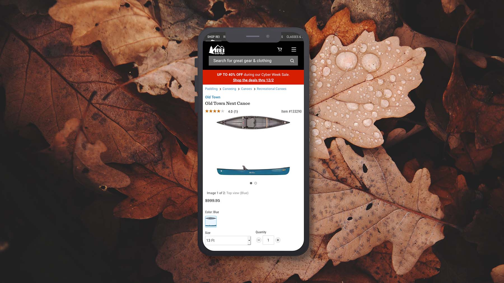
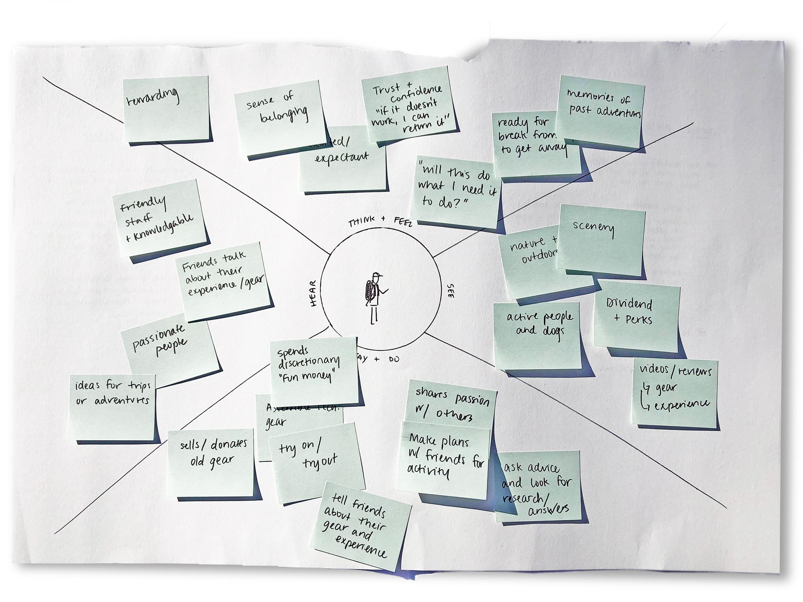
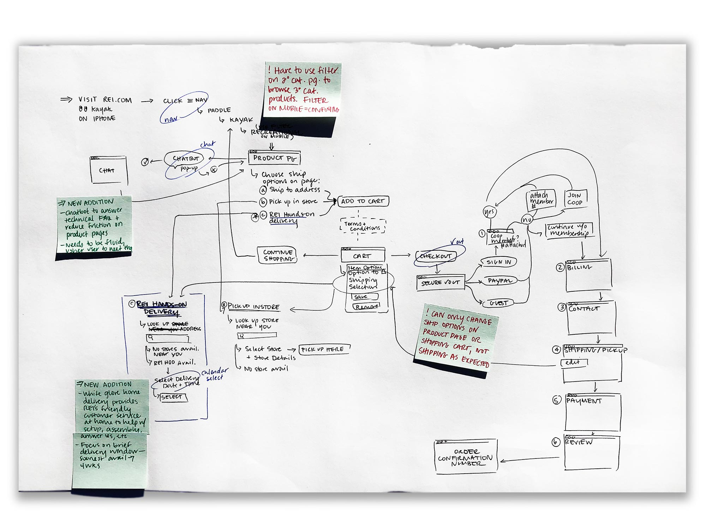
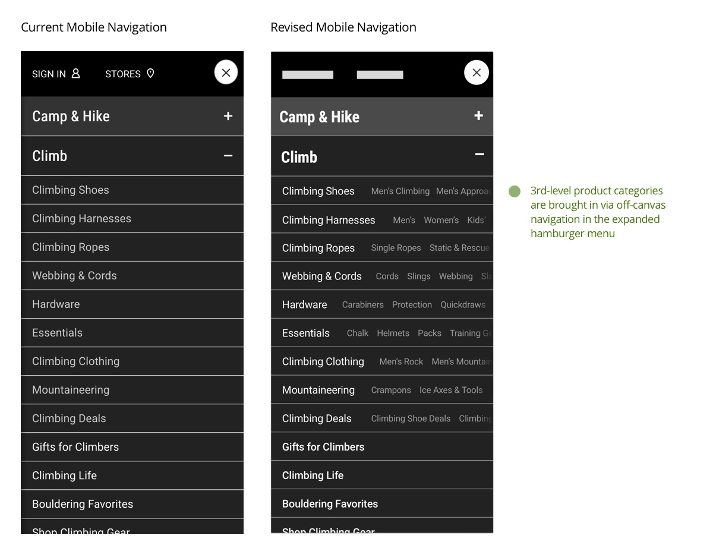

# REI
##subtitle

###Challenge
#####How could REI evolve its web experience to leverage its expertise in fostering strong customer experiences and relationships?
REI has differentiated itself as a retailer through its passion for outdoor advocacy and dedication to superb customer experiences. Find opportunities to bring that same relational spirit to the shopping experience at REI.com.

**My Role** | UX, Product Strategy
**Tools Used** | Pen + Paper, Sketch
**Process** | [Research](#research), [Insights & Opportunities](#insights), [The Problem](#problem), [UX Solutions](#solution), [Prototypes](#prototypes)
***
###Research
#####REI.com users want to belong to a community that is passionate about the outdoors.
I interviewed several REI customers who had shopped both online and in stores over the last few months. Why did they choose REI? How did they find what they were looking for? Why would they choose to shop online vs. in person? I wanted to discover customer attitudes and behaviors before, during, and after purchase.

I took those findings and made an empathy map to get a sense of who I was designing for—the outdoorsy type whose REI purchases are sparked by passion and a sense of belonging, both to nature and the community of people who join on their adventures.

#####REI.com includes lots of experience-focused content, but it’s partitioned from the ecommerce user flow.
An audit of REI’s current website revealed a huge amount of content to support its customers’ adventures, including expert advice, ideas for local excursions, and guided expeditions around the world. The ecommerce experience was well designed but failed to incorporate any features that felt like the in-store experience.

###Insights & Opportunities
#####Users generally know what they want, but often have technical questions while they’re shopping or after purchase. 
Mapping the research uncovered 3 opportunities:

* When searching for products, users typically aren’t just browsing—they have specific product types and use cases in mind.
* When shopping for technical gear, users are looking for answers to technical questions.
* Users look forward to the receipt of technical items as an event and set aside time for assembly and trial.

###The Problem, Defined
**REI customers know what they’re looking for, they’re just not always sure about the nitty gritty details. They shop at REI because they trust the co-op and appreciate the knowledgeable staff, but the company misses opportunities to incorporate these qualities in the online experience.**
###Design Solutions
#####Make responsive navigation more precise.
On mobile, users lose the precision of the tertiary product category navigation, which disappears when the meganav converts to a hamburger menu at the tablet breakpoint. By bringing that nav option back via off-canvas navigation, users can jump more quickly to the products they’re looking for.

#####Introduce a chat bot to answer technical questions and ease product comparison.
Currently, technical questions are answered to some extent via “tech spec” and Q&A-style content blocks on product detail pages. These tactics are limited, however. Introducing a chat bot facilitates 3 key things:

* A friendly voice to directly answer customer questions and bring the flavor of in-store customer service online
* A quick way for users to jump back and forth between product pages as they comparison shop
* Invaluable data for REI on users’ technical questions, concerns, and browsing behavior

#####Add a hands-on delivery option by REI team member.
For bulky items that require oversize shipping fees, REI could introduce a bespoke, hands-on delivery service for addresses within a given radius of retail stores. A knowledgeable REI team member would personally deliver the item—a mountain bike or kayak, for example—and be on hand to help with assembly, answer questions, and reinforce REI’s dedication to excellent customer experiences.

